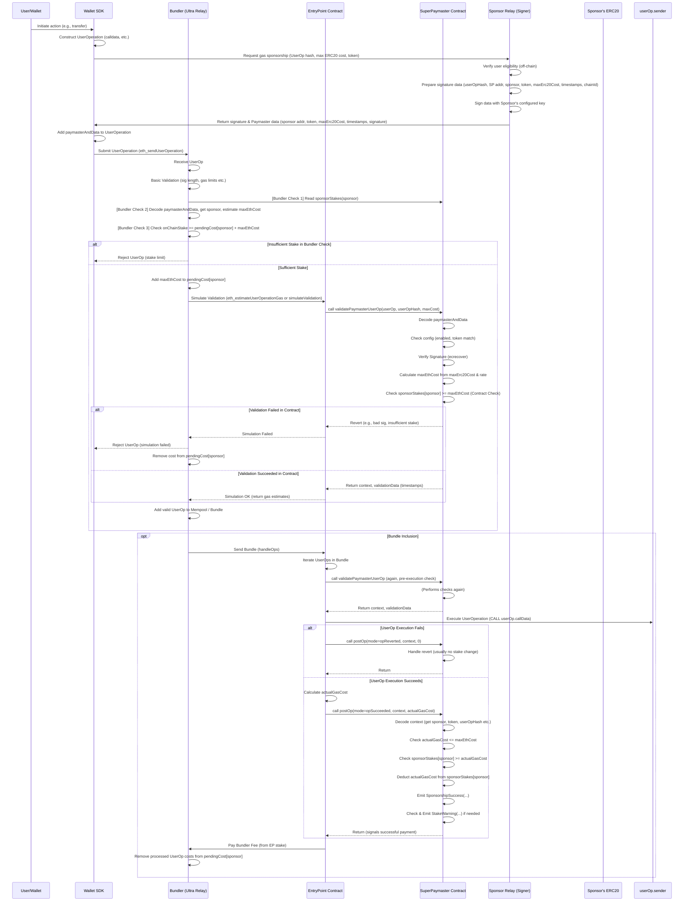

# SuperPaymaster v0.2
We finished the basic version v 0.1 in [ETHTaiPei2024](https://taikai.network/ethtaipei/hackathons/hackathon-2024/projects/cltjx090k04c7wc01w1ib9lbi/idea)
Now we launched new version v0.2 with decentralization、seamlessly and community-owned.

We create this based on Account-Abstraction (EIP-4337) singleton EntryPoint release [Entrypoint contract](https://github.com/eth-infinitism/account-abstraction/releases) and Pimlico's [Singleton Paymaster](https://github.com/pimlicolabs/singleton-paymaster)(ZeroDev is also used this version).

For PoC, we use flat version(all in one) to show the structure.


## Why we create SuperPaymaster?
We need a **Decentralized\Seamlessly\Low Cost** paymaster.
Current blockchain gas payments impede widespread adoption due to high costs, complexity, and poor user experience (UX) rooted in HCI challenges. While Account Abstraction (ERC-4337) offers potential, centralized implementations often introduce critical risks like censorship and price manipulation, undermining decentralization.
This paper introduces SuperPaymaster, a novel gas payment system using ERC-4337 and a Standardized Decentralized Service System (SDSS) to create a truly decentralized, competitive, and user-friendly ecosystem. It directly tackles high costs, usability friction, and centralization vulnerabilities. SuperPaymaster provides an open-source framework enabling permissionless Paymaster nodes via a unified contract, fostering competition, supporting diverse ERC-20 gas tokens, and integrating with secure accounts like AirAccount via SDSS for streamlined, secure interactions.
By optimizing gas payments through decentralization and enhanced UX, SuperPaymaster aims to significantly lower entry barriers, improve blockchain interaction efficiency and usability, and ultimately accelerate Web3 adoption. A Proof-of-Concept (PoC) demonstrates the system's feasibility and potential advantages.

## What is the unique feature of the SuperPaymaster?
We provide:
- a Permissionless & Open-Source Paymaster framework permitting anyone to run a paymaster serverice.
- a DePIN solution to run all nodes based on SDSS() with a Rain Computing mode(according to the Cloud Computing).
- a OpenCard&OpenPNTs protocol with any community PNTs as gas token to pay gas with your task getting PNTs.
- So, we will get a **decentralized gas sponsor network, a competitive gas sponsor market and a simple gas card**.

## How do we provide these feats?
We use Technology Acceptance Model (TAM) and Human-Computer Interaction (HCI) to guide us on enhancing current solution.
We combine so many technology concepts and operation steps into one daily thing: gas card.
We create a two side market and a community-driven task PNTs system to help normal get negative cost on gas payment.
We build this on Ethereum community open source repositories as mentioned above.

[a collection show on HCI](https://docs.google.com/spreadsheets/d/1g1PlP0TPAyWSWnJJapfoh10z0ury78Y4ls5OL3O2_pc/edit?usp=sharing)


## What is AAStar?
AAStar is a team incubated by Plancker^ community, we focus on Account Abstraction and related topics.
We are trying to sweeping the tech barrier of mass adoption on the Human digital future.
We are Ethereum builder who attracted by the idea: "Human Digital Future".

## Components we add (PoC)
1. Stake module: Contract balance account stake management
2. Verify and Pay: paymasterAndData Signature verification, payment, record and balance record change(follow ERC4337, nochange on original flow,just enhance verification to adapt permissionless nodes public key ).
3. Post Processing: Transaction success post processing: reputation increase, TODO, ERC7253
4. Compensation: Asynchronous transaction status compensation: failed and successful re-check, proof submission and reputation modification (off-chain, call on-chain method) TODO

### V0.7 Flow



#### Description

1.  **User Initiates Action:** The user initiates a gas-requiring operation through their wallet.
2.  **SDK Builds UserOp:** The wallet SDK constructs a basic `UserOperation`.
3.  **Request Sponsorship:** The SDK sends a request to the configured Sponsor Relay Server, including the `UserOperation` hash, maximum ERC20 token amount, and token address.
4.  **Relay Signs:** The Relay Server verifies user eligibility (optional, off-chain logic), then uses the Sponsor's authorized signing key configured in the SuperPaymaster contract to sign data containing `userOpHash`, Paymaster address, Sponsor address, Token address, maximum ERC20 cost, timestamps, and chain ID.
5.  **SDK Assembly:** The SDK receives the signature and relevant data (Sponsor address, Token, maximum cost, timestamps), encodes it, and places it in the `paymasterAndData` field of the `UserOperation`.
6.  **Submit to Bundler:** The SDK submits the complete `UserOperation` to the Bundler.
7.  **Bundler Verification:**
    * The Bundler receives the UserOp and performs basic checks.
    * **Key Step:** The Bundler identifies this as a SuperPaymaster UserOp, extracts the Sponsor address, and **calls the SuperPaymaster contract to query the Sponsor's current on-chain stake balance**.
    * The Bundler **checks its internally maintained pending cost (`pendingCost`) for that Sponsor**, ensuring `onChainBalance >= pendingCost + estimated maximum ETH cost for current UserOp`.
    * If the Bundler check fails, it rejects the UserOp.
    * If successful, the Bundler adds the current UserOp cost to `pendingCost[sponsor]`, then **simulates the validation process** (`eth_estimateUserOperationGas` or `simulateValidation`).
8.  **Contract Validation (Simulation):**
    * EntryPoint calls SuperPaymaster's `validatePaymasterUserOp`.
    * SuperPaymaster decodes the data, checks Sponsor configuration, verifies the Relay Server's signature, calculates maximum ETH cost, and **checks the Sponsor's on-chain balance again**.
    * If validation fails, the simulation fails, the Bundler rejects the UserOp and updates `pendingCost`.
    * If successful, the simulation succeeds, the Bundler gets gas estimates and adds the UserOp to the mempool or pending bundle.
9.  **Bundle Submission:**
    * The Bundler submits the Bundle to the EntryPoint's `handleOps`.
    * EntryPoint calls `validatePaymasterUserOp` again for final validation.
    * EntryPoint executes the user's `callData`.
    * **Post-Execution:** EntryPoint calls SuperPaymaster's `postOp`.
10. **Payment and Settlement (`postOp`):**
    * SuperPaymaster finds the Sponsor based on `context`.
    * It verifies and **deducts the actual `actualGasCost` from the Sponsor's internal `sponsorStakes` mapping**.
    * It triggers the `SponsorshipSuccess` event.
    * It checks if the balance is below the threshold, triggering the `StakeWarning` event if so.
    * `postOp` successfully returns. EntryPoint deducts gas fees from SuperPaymaster's total deposit in EntryPoint and pays the Bundler.
11. **Bundler Cleanup:** The Bundler clears the amounts related to processed UserOps from its internal `pendingCost` after confirming the Bundle has been included on-chain.


## Foundry

**Foundry is a blazing fast, portable and modular toolkit for Ethereum application development written in Rust.**

Foundry consists of:

-   **Forge**: Ethereum testing framework (like Truffle, Hardhat and DappTools).
-   **Cast**: Swiss army knife for interacting with EVM smart contracts, sending transactions and getting chain data.
-   **Anvil**: Local Ethereum node, akin to Ganache, Hardhat Network.
-   **Chisel**: Fast, utilitarian, and verbose solidity REPL.

### Init forge
```
curl -L https://foundry.paradigm.xyz | bash
source /Users/nicolasshuaishuai/.zshenv && foundryup
forge install OpenZeppelin/openzeppelin-contracts ensdomains/ens-contracts --no-commit

forge build

````

## Features 
1. 因为是多租户Paymaster，对于stake和管理余额，需要更多的思考，例如还在进行中的交易余额，是需要锁定的，不可以直接按照余额来withdrawl，而是要需要确认：签名不再有效，从superpayermaster的可验证可支付的账号权限中取消，待withdrawl之后从注册中移除，同时从bundler移除

## Documentation

https://book.getfoundry.sh/

## Usage

### Build

```shell
$ forge build
```

### Test

```shell
$ forge test
```

### Format

```shell
$ forge fmt
```

### Gas Snapshots

```shell
$ forge snapshot
```

### Anvil

```shell
$ anvil
```

### Deploy

```shell
$ forge script script/Counter.s.sol:CounterScript --rpc-url <your_rpc_url> --private-key <your_private_key>
```

### Cast

```shell
$ cast <subcommand>
```

### Help

```shell
$ forge --help
$ anvil --help
$ cast --help
```
